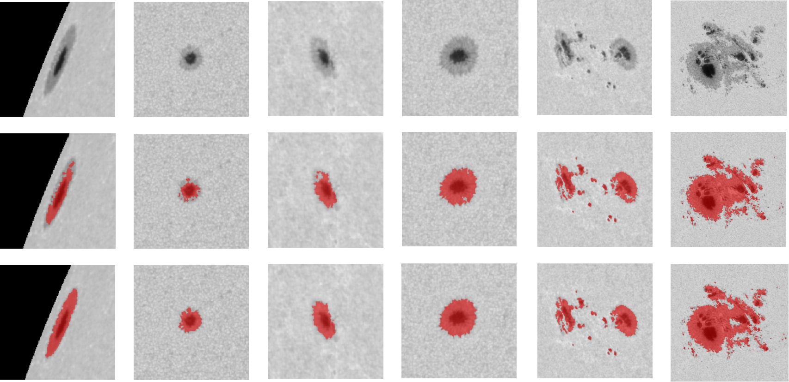

# A bias-free deep learning approach for automated sunspot segmentation

This project explores deep learning methods to automate sunspot identification in solar satellite images, keeping personal bias to the minimum.       Utilizing observations of the Solar Dynamics Observatory (SDO), we leverage active region data from the HMI Active Region Patches (HARP) to locate sunspot groups detected.       The Morphological Active Contour Without Edges (MorphACWE) technique is applied to produce pseudo-labels, which is utilized to train the U-Net deep learning architecture, combining their strengths for robust segmentation.

The pseudo-labels generation part of this project is adapted from [SheffieldSolarCatalog](https://github.com/gyengen/SheffieldSolarCatalog)

Comparison of the segmentation results: continuum images after pre-processing (top), MorphACWE segmentation
results (middle), U-Net segmentation results (bottom).

## Create environment with GPU-enabled version:

	#Run the commandline
	conda env create -f environment.yml
	conda activate sunspot_env

## Download datasets:
to download SDO and HARP

	#Run the commandline
    cd ./ssc_engine/
    python download_run.py

## Pseudo-labels
to make pseudo-labels

	#Run the commandline
	cd ./ssc_engine/
	python SSC_run.py

## Train:
to train your own model

	#Run the commandline
	cd ./unet/
	python UNet_slice_train.py

## Predict:
to test our model

	#Run the commandline
	cd ./unet/
	python UNET_predict.py